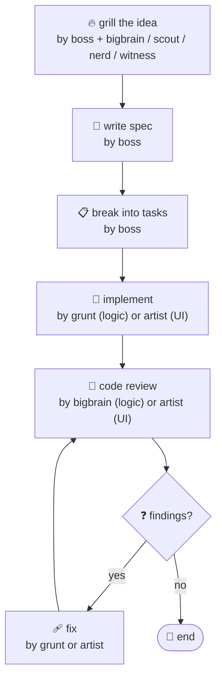

## 🤖 Agents

- 🎯 **boss** — orchestrates: plans, delegates, reconciles, verifies
- 🔍 **scout** — fast codebase search and pattern matching
- 🤓 **nerd** — external docs and library research
- 🧠 **bigbrain** — architecture, debugging, and code review
- 🎨 **artist** — UI/UX design, review, and implementation
- 🔨 **grunt** — bounded, headless implementation
- 👁️ **witness** — visual analysis of images, PDFs, and diagrams

## 🔁 Workflow

All work routes through boss. It delegates each step to the right agent; agents never talk to each other.

