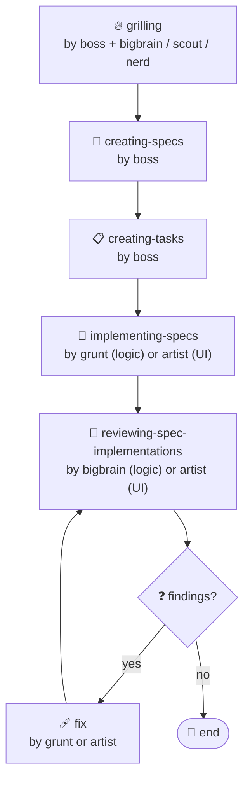

## 🤖 Agents

- 🎯 **boss** (Opus 5.5, medium effort) — orchestrates: plans, delegates, reconciles, verifies
- 🔍 **scout** (Haiku, low effort) — fast codebase search and pattern matching
- 🤓 **nerd** (Haiku, low effort) — external docs and library research
- 🧠 **bigbrain** (Fable, high effort) — architecture, debugging, and code review
- 🎨 **artist** (Sonnet 5.5, medium effort) — UI/UX design, review, and implementation
- 🔨 **grunt** (Sonnet 5.5, medium effort) — bounded, headless implementation

## 🔁 Workflow

All work routes through boss. It delegates each step to the right agent; agents never talk to each other.

```mermaid
flowchart TD
    A["🔥 grilling<br/>by boss + bigbrain / scout / nerd"] --> B["📝 creating-specs<br/>by boss"]
    B --> C["📋 creating-tasks<br/>by boss"]
    C --> D["🔨 implementing-specs<br/>by grunt (logic) or artist (UI)"]
    D --> E["🔎 reviewing-spec-implementations<br/>by bigbrain (logic) or artist (UI)"]
    E --> F{❓ findings?}
    F -->|yes| G["🩹 fix<br/>by grunt or artist"]
    G --> E
    F -->|no| H(["🏁 end"])
```
