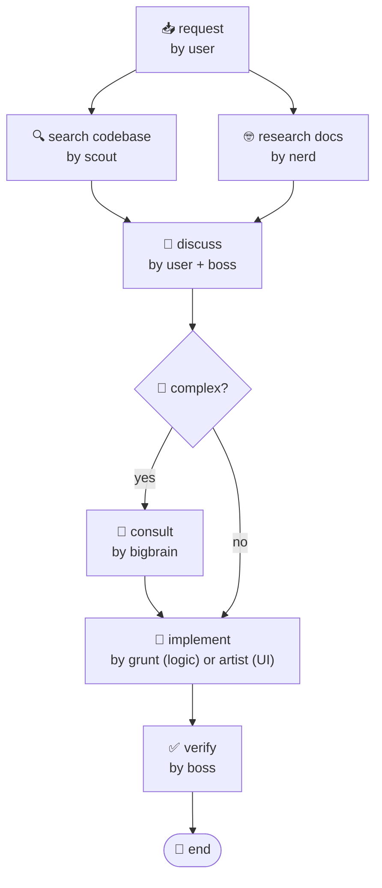

## 📖 Glossary

- **Crew** — five agents with opposing viewpoints, used only by the huddling skill.
- **Grilling** — a session where boss questions the user hard about a decision or idea.
- **Handoff** — a standalone summary of the current conversation so a fresh session can continue the work.
- **Huddle** — a session where the crew answers a question independently, reviews each other's answers anonymously, and bigbrain gives a verdict.
- **Spec** — a written plan for any change (problem, solution, user stories), synthesized from the conversation by the creating-specs skill.
- **Task** — one vertical slice of a spec, listing the tasks that block it; implemented by grunt or artist.
- **Workbench** — a local directory that stores specs, tasks, grillings, questionnaires, and handoffs outside the repo.

## 🤖 Agents

- 🎯 **boss** (Opus 5.5, medium effort) — orchestrates: plans, delegates, reconciles, verifies
- 🔍 **scout** (Haiku, low effort) — fast codebase search and pattern matching
- 🤓 **nerd** (Haiku, low effort) — external docs and library research
- 🧠 **bigbrain** (Fable, high effort) — architecture, debugging, and code review
- 🎨 **artist** (Sonnet 5.5, medium effort) — UI/UX design, review, and implementation
- 🔨 **grunt** (Sonnet 5.5, medium effort) — bounded, headless implementation

### 🗣️ Crew (huddling only)

- 🗣️ **hater** (Opus 5.5, medium effort) — hunts for the fatal flaw
- 🗣️ **toddler** (Opus 4.6, medium effort) — strips assumptions, asks "but why?"
- 🗣️ **hypeman** (Opus 4.6, medium effort) — finds upside and adjacent opportunities
- 🗣️ **rando** (Sonnet 5.5, medium effort) — outsider view; catches the curse of knowledge
- 🗣️ **hustler** (Opus 5.5, medium effort) — fastest path to done; flags ideas with no first step

These five agents are only used by the huddling skill.

## 🔁 Workflow

All work routes through boss. It delegates each step to the right agent; agents never talk to each other.

### ⭐ Main workflow

```mermaid
flowchart TD
    A["📥 request<br/>by user"] --> B["🔍 search codebase<br/>by scout"]
    A --> C["🤓 research docs<br/>by nerd"]
    B --> D["💬 discuss<br/>by user + boss"]
    C --> D
    D --> E{🤔 complex?}
    E -->|yes| F["🧠 consult<br/>by bigbrain"]
    F --> G
    E -->|no| G["🔨 implement<br/>by grunt (logic) or artist (UI)"]
    G --> H["✅ verify<br/>by boss"]
    H --> I(["🏁 end"])
```

### 📝 Spec workflow

```mermaid
flowchart TD
    A["🔥 grilling<br/>by boss + bigbrain / scout / nerd"] --> B["📝 creating-specs<br/>by boss"]
    B --> C["📋 creating-tasks<br/>by boss"]
    C --> D["🔨 implementing-specs<br/>by grunt (logic) or artist (UI)"]
    D --> E["🔎 reviewing-spec-implementations<br/>by bigbrain (logic) or artist (UI)"]
    E --> F{❓ findings?}
    F -->|yes| G["🩹 fix<br/>by grunt or artist"]
    G --> E
    F -->|no| H(["🏁 end"])
```
